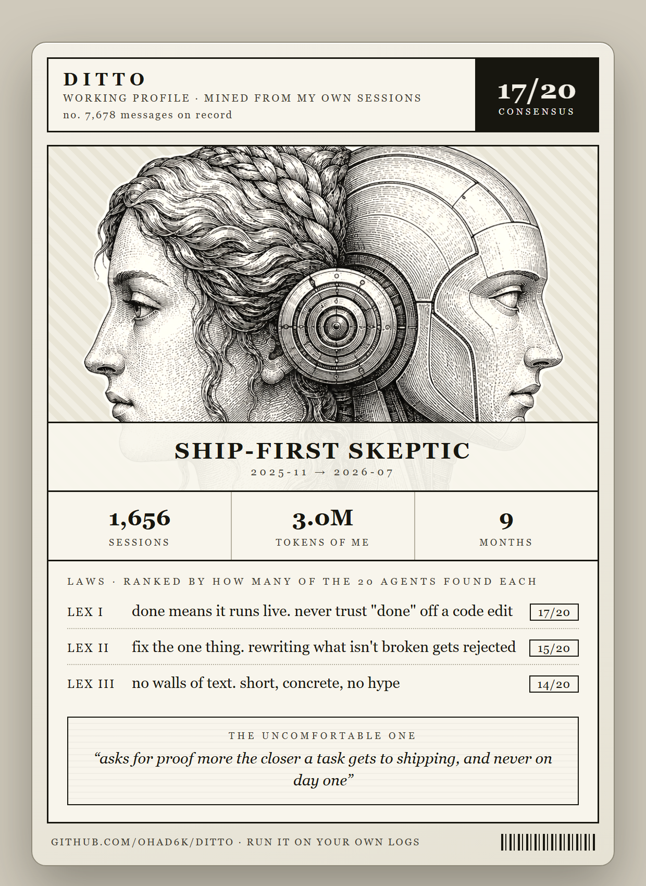

<!-- mcp-name: io.github.ohad6k/emulo -->
<p align="center"></p>

<h1 align="center">Emulo</h1>

<p align="center"><b>Your AI agents act like they just met you. Emulo fixes that.</b></p>

<p align="center">

<a href="https://discord.gg/QMnYtVcxk2"></a>


</p>

Your real coding-agent sessions already contain the rules you never wrote down: what “done” means, what you reject on sight, how you debug, how you design UI, and how you write when you are actually working.

Emulo mines selected evidence from those sessions — Claude Code, Codex, Copilot CLI, OpenCode, and Google Antigravity logs out of the box — into a private working profile your agent reads before every task. Separate layers for work, design, writing, and video mean the right part of you loads for the right task.

The [Emulo Proof v1 methodology](docs/proof/README.md) is an unexecuted methodology until a separately approved evidence release exists.

## Open source and Emulo Pro

Emulo's local engine stays MIT licensed and useful without an account. Your
session extraction, redaction, caches, profile, and agent adapters remain on
your machine unless you explicitly choose a model provider for mining.

[Emulo Pro](https://emulo.vercel.app/#pricing) is the optional hosted layer for
client-encrypted approved-generation continuity across up to five devices,
managed pairing and revocation, conflict-preserving history, and a bounded
encrypted recovery/export window. Raw session evidence, decryption keys, and
model-provider tokens do not enter the hosted service. Ending Pro access never
disables local Emulo, its history, or rollback.

The hosted Worker source is public so its authentication, checkout, webhook,
and entitlement rules can be audited. Production credentials and customer
records are held by Cloudflare and Polar and are never stored in Git. Public
source code is not public access to the hosted service or its data.

## Not memory

Memory is what you explicitly told the model.

Emulo mines what your work already proved about you: what you reject, what "done" means, when you ask for proof, how you talk when you're actually working, and the agent behaviors that make you stop the task.

That's why it reads raw session logs, not your `CLAUDE.md` or rules file.

## A real run

One line to the same agent, twice: **"help me post emulo on reddit."** Once cold, once with the Emulo profile loaded.

<table>
<tr>
<th width="500">🡒 agent</th>
<th width="500">🡒 agent + emulo</th>
</tr>
<tr valign="top">
<td>

Here's how I'd play it.

**Subreddits:** r/ClaudeAI and r/ChatGPTCoding are your core audience. r/LocalLLaMA fits the local angle. r/cursor, r/SideProject, r/opensource for reach. Don't blast all at once — post to one, tune the title, repost over a few days.

**Title:** I built a local tool that reads your AI coding logs and writes a "you.md" your agents read before every task

<details open>
<summary>full reply</summary>

**Titles (pick per sub):**
- I built a local tool that reads your AI coding logs and writes a "you.md" your agents read before every task
- emulo: mine your own Claude Code history into a profile so your agent codes like you (local, open source)

**Body:**
> Every fresh agent session starts from zero — it doesn't know how you work, so you re-explain yourself every time. All of that is already in your session logs. So I built **emulo**: it reads your history, mines how you decide and talk, and writes a `you.md` your agents read before every task.
> - runs locally, your logs never leave your machine
> - redacts secrets before processing
> - open source: [link]

Also: open with the pain not the product, reply fast in the first hour, add a demo gif, and flair it correctly. Want me to write tuned variants for each subreddit?

</details>
</td>
<td>

the insight first: the mining number is your whole post. "i read 1,656 of my own sessions" is a confession, not a pitch, and nobody scrolls past a confession. lead with the mirror, not the mechanism.

one sub, not five — a skills sub, where people come looking for this instead of arguing about it.

**Title:** I built a Claude skill from 8 months of my own Claude Code sessions

<details open>
<summary>the full post it wrote</summary>

**body:** I use claude code and codex every day. 8 months, solo. every session gets logged and i never really looked back at them.

then it hit me that those logs are probably the most honest record of how i actually work. not my CLAUDE.md, not my docs, not the rules i remembered to write down. the real sessions.

so i built emulo.

What I did: pulled every message i typed from my local claude/codex logs. stripped tool output, pasted errors, file dumps, and assistant replies. kept only my words. came out to around 1,656 sessions and almost 3M tokens of just me.

then i split it into chunks and had agents read each slice. each one pulled patterns like how i define done, what kind of code i reject, when i ask for proof, what makes me stop a task, and how i talk when i am actually working.

then i merged the repeated traits into one you.md.

the useful part is that it installs as a claude skill. so now instead of starting every task cold, claude reads my profile first and already knows how i work.

not memory exactly. memory is what you told the model. this is more like mining what your work already proved about you.

</details>
</td>
</tr>
</table>

I posted it on r/ClaudeSkills, as written:

<p align="center"></p>

<p align="center"><strong>200 upvotes &middot; 32 comments &middot; 102K views</strong><br>
<sub>from an account with no followers. The cold plan was reasonable. The loaded plan knew its user's voice — and it worked.</sub></p>

## What it finds

The kind of rules a mine pulls out, each backed by dated verbatim receipts from real sessions:

> **done means it runs live.** never trust "done" off a code edit. show it working first.
>
> **fix the one thing.** rewriting or "cleaning up" code that isn't the problem gets rejected every time.
>
> **builds faster than they understand what they built** — then asks the agent to explain their own system back.
>
> **gets frustrated by repeating the same ask** until it lands, not by escalating.

Nobody wrote those rules down. They came out of one person's own history, with receipts.

> This is an example. Yours is mined from your logs and will read nothing like it.

## The card

After mining, `python emulo.py --card` renders your profile as a shareable card: archetype, top laws ranked by distinct supporting session receipts, coverage stats, and one sharp truth.

<p align="center"></p>

Share the card or one short trait, never your full profile.

## Quickstart

Install the cross-agent bootstrap — runs in Claude Code and Codex, and installs profiles for Cursor and Gemini through the explicit adapters:

```bash
npx skills add ohad6k/emulo@emulo
```

Then tell your agent:

```text
run emulo
```

That installs the bootstrap and creates a read-only full-history mining plan. Your agent must show the cost and wait for approval before model work. It does not install native namespaced routing.

### Native Codex plugin

The native plugin adds `emulo:mine`, `emulo:work`, `emulo:design`, `emulo:write`, and `emulo:video`:

```bash
codex plugin marketplace add ohad6k/emulo --ref v0.5.0 --json
codex plugin add emulo@emulo --json
```

The plugin-install command itself scans no logs, writes no private profile state, and schedules zero mining model calls. Asking an agent to install, run, or update Emulo still consumes that host interaction plus its normal system and tool overhead.

### Native Claude Code plugin

The Claude Code plugin exposes the same four skills. Install it from inside Claude Code:

```text
/plugin marketplace add ohad6k/emulo
/plugin install emulo@emulo
```

## MCP server

Emulo also ships a Model Context Protocol (MCP) server, so any MCP client — Claude Desktop, Cursor, and other agents — can load your profile before a task. The server implements MCP over stdio and exposes one tool, `load_emulo_profile`, which returns your mined work, design, or writing profile over the Model Context Protocol.

Run it from the published package with `uvx emulo mcp`, or from a checkout with `python emulo.py mcp`, and point an MCP client at it:

```json
{
  "mcpServers": {
    "emulo": { "command": "uvx", "args": ["emulo", "mcp"] }
  }
}
```

The MCP server is stdlib-only and serves the profile you already mined locally; it makes no network calls of its own.

## What happens when you run it

Emulo first prints a read-only plan:

```json
{
  "valid_sessions": "--",
  "post_dedupe_source_tokens": "--",
  "mode": "full",
  "profile_scope": "full_profile",
  "quality_default": true,
  "candidate_index": null,
  "selected_source_tokens": "--",
  "planned_worker_calls": "--",
  "planned_reducer_calls": "--"
}
```

The full-history quality default reads all eligible history. Emulo shows the exact plan first and waits for approval before any worker or reducer runs. Cached reports are reused, so the displayed remaining cost can fall over time.

If you explicitly want a cheaper first look, ask for `run emulo quick preview` or use `--preview`:

```bash
python emulo.py plugin preflight --preview
```

Quick preview creates a starter profile from selected history, not the full profile.

The quick-preview ladder is:

| Candidate | New source text | Maximum planned passes |
|---|---:|---:|
| 4 × 25K | 100K tokens | 4 workers + 1 reducer |
| 6 × 25K | up to 150K tokens | up to 6 workers + 1 reducer |
| 8 × 25K | 160K-token hard cap | up to 8 workers + 1 reducer |

The frozen calibration recovered only 5 of 22 required traits at the widest bounded candidate. Quick preview therefore cannot be described as the quality default unless a future run passes all 22 frozen requirements. The permanent non-private baseline is in `tests/fixtures/bounded-calibration-baseline.json`.

The first real full-history release mine recovered 12 of the same 22 frozen requirements: work `5/10`, design `5/5`, and writing `2/7`. Full history remains the quality default because it materially improves recall over preview, not because it guarantees a complete personal model. The validated pack keeps only supported rules; missing traits require future mining improvements rather than a softened score.

On update, unchanged segment and evidence hashes are reused. An identical update plans zero additional Emulo mining passes. New history plans only affected full-history work plus one reducer.

These are selected source tokens and planned worker/reducer passes, not provider billing events. Emulo cannot measure provider system prompts, tool traffic, orchestration overhead, or a percentage of a proprietary subscription allowance.

### Experimental adaptive recall

The receipt-salience and scout pipeline remains available to developers through explicit `--stage A`, but it is experimental and is not used by the Plugin release, quality-default setup, updates, or calibration.

## What makes the result trustworthy

- Only real user-authored `.jsonl` messages are mined. `AGENTS.md`, `CLAUDE.md`, memory files, and typed self-descriptions are rejected as source evidence.
- Every bounded worker covers work, design, writing, and video in one validated report.
- Quotes must be short, dated, verbatim receipts from known session IDs.
- Inferred rules require at least two distinct sessions and, when available, two source/time strata.
- One uncontradicted explicit instruction may survive as low-frequency evidence.
- Generic filler, invented quotes, unresolved contradictions, partial profile packs, and corrupt caches fail closed.

The native loaders are deliberately separate:

| Skill | Loads |
|---|---|
| `emulo:work` | Core working profile |
| `emulo:design` | Core + design taste |
| `emulo:write` | Core + writing voice |
| `emulo:video` | Core + video taste |
| `emulo:mine` | Only explicit setup, update, or deepen requests |

## Privacy

Emulo's extractor, redaction, caches, and generated profiles stay local. Selected redacted text is processed by the model provider you choose. With a local model, the entire mining flow can remain local.

`emulo.py` itself is one stdlib-only file and makes no network calls. The skills.sh command downloads the selected bootstrap. Outside a repository checkout, that bootstrap downloads only `emulo.py` and `MINING_PROMPT.md` from the exact release tag after SHA-256 verification. Those downloads happen before log discovery and read no session data.

Redaction is best-effort and runs before selected text is written to Emulo caches. Inspect private output before sharing it. Share the card or one short trait, never your full profile or receipt appendix.

See [SECURITY.md](SECURITY.md) for the exact boundary.

## Raw one-file CLI

The legacy extractor remains available and backward compatible:

```bash
curl -O https://raw.githubusercontent.com/ohad6k/emulo/v0.5.0/emulo.py
python emulo.py --dry-run
python emulo.py --chunks 4 --out emulo-out
```

Manual adapters remain available:

```bash
python emulo.py --install you.md --target codex
python emulo.py --install you.md --target claude
python emulo.py --install you.md --target cursor --repo .
python emulo.py --install you.md --target agents --repo .
python emulo.py --install you.md --target gemini --repo .
python emulo.py --install you.md --target opencode
```

## Support matrix

| Surface | Status in this release |
|---|---|
| Codex native plugin | Proven locally with four namespaced skills |
| Codex skills.sh bootstrap | Supported |
| Claude Code skills.sh/direct adapter | Supported |
| Claude native plugin | Not claimed; host unavailable during validation |
| Cursor / Gemini adapters | Supported through explicit install commands |
| OpenCode | Both directions verified live: sessions mined from its SQLite store and legacy JSON layout (`--source opencode`), profile installed to its global rules (`--target opencode`) |
| Google Antigravity | Mining verified live against a real local install (`--source antigravity`): typed prompts extracted from `~/.gemini/antigravity/brain` transcripts, harness envelopes stripped. Antigravity only writes transcripts when interaction logging is enabled in its privacy settings |
| OpenClaw / Hermes Agent | Profile skill discovery verified locally; [guide](docs/OPENCLAW_HERMES.md) |

## Updating and notifications

Run `update emulo` to reuse stable caches and plan only changed work.

A GitHub star bookmarks the repository but does not subscribe you to releases. To receive release notifications, choose **Watch → Custom → Releases** on GitHub.

## Limits

- Emulo models how you work, design, write, and make videos. It does not make the underlying model smarter.
- Sparse or repetitive histories can leave design or writing inactive. Emulo reports the exact targeted-deepen instruction instead of inventing a persona.
- Provider token accounting remains outside Emulo's exact measurement.
- Benchmarks, leaderboard results, and proof videos are a separate later release.

## FAQ

The three things people push back on, answered once.

**"Why not just ask Claude to summarize my logs?"**

One pass can't do it. My history is 1,656 sessions, about 3M tokens after extraction, and the raw logs are mostly tool output, file dumps, and pasted errors. A single summarize call burns the window on that noise. Emulo keeps only the words you typed, gives each validated segment its own evidence pass, and requires distinct supporting sessions before an inferred rule can survive. The resulting profile keeps session receipts instead of an obsolete worker-count score.

**"Claude already has memory. Why do I need this?"**

Use both. Memory is what you told the model: curated notes, `CLAUDE.md`, and it stays inside one tool. Emulo reads supported raw sessions from Codex, Claude Code, Copilot CLI, OpenCode, and Google Antigravity and pulls out what you never wrote down: what you reject, what "done" means to you, and when you demand proof. The output is plain files you own and can load through supported agents.

**"Claude only keeps 30 days of logs. Where did 9 months come from?"**

Claude Code's retention is a setting (`cleanupPeriodDays`, 30 by default), and my longer history combines Claude Code, Codex, and Copilot CLI sessions plus archives. If you keep the default retention, older Claude sessions can roll off before Emulo sees them. Raise the retention, then mine what's left.

## Roadmap

See [ROADMAP.md](ROADMAP.md) for what is intentionally deferred.

## Community

- [Share what Emulo found](https://github.com/ohad6k/emulo/issues/1)
- [Discord](https://discord.gg/QMnYtVcxk2)

## License

MIT. Made by [@ohad6k](https://github.com/ohad6k).
