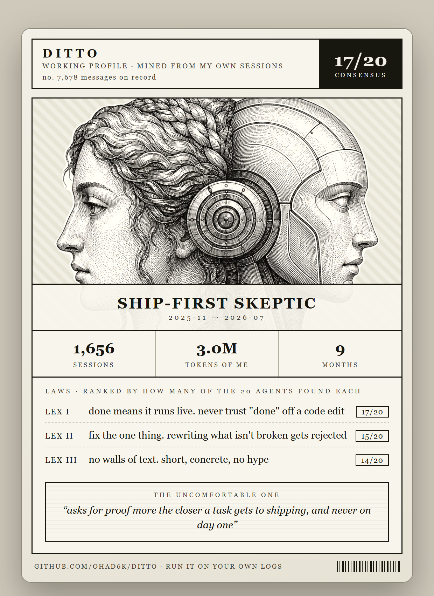

<!-- mcp-name: io.github.ohad6k/emulo -->
<p align="center"></p>

<h1 align="center">Emulo</h1>

<p align="center"><b>Mine the messages you typed to your coding agents into a you.md profile, every rule with dated receipts, and install it where your agent can read it.</b></p>

<p align="center">

<a href="https://discord.gg/QMnYtVcxk2"></a>


</p>

Your real coding-agent sessions already contain the rules you never wrote down: what “done” means, what you reject on sight, how you debug, how you design UI, and how you write when you are actually working.

Emulo mines selected evidence from those sessions (Claude Code, Codex, Copilot CLI, OpenCode, and Google Antigravity logs out of the box) into a private working profile, where every rule carries dated quotes from your own messages, and installs it where your agent can read it. The agent mining flow writes separate files for work, design, writing, and video, so a host can load only the one that fits the task.

The aim is an agent that works the way you do from the first message. That is an aim, not a result: [what is tested so far](#what-is-tested-so-far) is below, including the part that did not go our way.

Installing a profile and an agent actually reading it are two different things. In a host-by-host test on 2026-09-25, the profile reached the model through a project `AGENTS.md` in Codex (`--target agents --repo .`, verified end to end in one test) and was loaded into OpenCode's instructions. In Claude Code the `you` skill installs but is not reliably opened on its own; typing `/you` loads it. Cursor, Gemini, OpenClaw and Hermes Agent get the file where they look for it, and loading there is not verified. The [support matrix](#support-matrix) has each one.

The [Emulo Proof v1 methodology](docs/proof/README.md) is an unexecuted methodology until a separately approved evidence release exists.

## The video layer, and where it comes from

<p align="center"></p>

A spec commercial, made in Claude Design. No After Effects and no motion software:
the whole thing is a composition rendered out to video.

It is **spec work**. It was not commissioned by Vercel and it was not made for
them. A brand was picked to see how far the motion could go.

It is here because `emulo:video` is mined from sessions like the one that
produced it. The other layers work the same way: the profile is not a template,
it is what survived from real work.

## Install

Inside Claude Code:

```text
/plugin marketplace add ohad6k/emulo
/plugin install emulo@emulo
```

Inside Codex:

```bash
codex plugin marketplace add ohad6k/emulo --ref v0.6.7 --json
codex plugin add emulo@emulo --json
```

Then run `emulo:mine` and point it at your session history. Everything below explains what that produces and why. If you want the CLI instead of the plugin, see [Quickstart](#quickstart).

## Open source and privacy

Emulo is MIT licensed, free, and works without an account or a sign-in. The tool
itself has nothing to buy. Separately, [the site](https://emulo.vercel.app/#pricing)
offers one optional paid service, a hand edit of a profile you already mined, and
you never need it to use Emulo.

Session extraction, redaction, caches, the profile itself, and the agent
adapters all stay on your machine. The one exception is mining: if you point it
at a hosted model, the selected evidence goes to that provider. Point it at a
local model and the whole run stays on your machine.

## Not memory

Memory is what you explicitly told the model.

Emulo mines what keeps coming up in your own sessions: what you reject, what "done" means, when you ask for proof, how you talk when you're actually working, and the agent behaviors that make you stop the task.

That's why it reads raw session logs, not your `CLAUDE.md` or rules file.

## What is tested so far

Emulo does three separate things, and they are held to different standards:

- **The usage report and `emulo verify`** are text matches on your own messages. They count and they trace quotes. They cannot tell you why anything happened.
- **Loading** means a host puts the profile in front of its model. Which hosts were seen doing that is in the [support matrix](#support-matrix).
- **Whether a loaded profile makes the agent's work better** is not shown. It is the aim, not a result.

What the published tests do show:

- An appended mined profile changed what the model produced, compared with no profile.
- In a 60 run study with every prediction written down in advance (August 2026), the mined profile did not separate from an invented profile of the same length on any of 9 comparisons. [emulo.vercel.app/placebo](https://emulo.vercel.app/placebo)
- In a September 2026 rerun with a later July 2026 profile (dated 2026-07-30) and a new invented profile, the mined profile separated from the invented one on 5 of 9 comparisons on Fable 5.1 and on 1 of 9 on Opus 5. [emulo.vercel.app/fable](https://emulo.vercel.app/fable)
- Both tests measure whether the output changed (rounded corners, colour saturation, card containers, length), not whether it got better.

## One example, not a test

An anecdote. One line to the same agent, twice: **"help me post emulo on reddit."** Once cold, once with the Emulo profile loaded. One run each way, with no control and no placebo, so it shows what two replies looked like, not what the profile does. Both replies are trimmed to their opening plan and title.

<table>
<tr>
<th width="500">🡒 agent</th>
<th width="500">🡒 agent + emulo</th>
</tr>
<tr valign="top">
<td>

Here's how I'd play it.

**Subreddits:** r/ClaudeAI and r/ChatGPTCoding are your core audience. r/LocalLLaMA fits the local angle. r/cursor, r/SideProject, r/opensource for reach. Don't blast all at once — post to one, tune the title, repost over a few days.

**Title:** I built a local tool that reads your AI coding logs and writes a "you.md" your agents read before every task

</td>
<td>

the insight first: the mining number is your whole post. "i read 1,656 of my own sessions" is a confession, not a pitch, and nobody scrolls past a confession. lead with the mirror, not the mechanism.

one sub, not five — a skills sub, where people come looking for this instead of arguing about it.

**Title:** I built a Claude skill from 8 months of my own Claude Code sessions

</td>
</tr>
</table>

The title is the agent's wording. The profile loaded was a profile the author mined in early July 2026 (1,656 sessions).

I posted the loaded version on r/ClaudeSkills. The numbers below are as shown in the screenshot, which shows the vote bar only, not the post or the date:

<p align="center"></p>

<p align="center"><strong>200 upvotes &middot; 32 comments &middot; 102K views</strong><br>
<sub>One post, so it says nothing about whether the profile caused any of that.</sub></p>

The controlled tests are at [emulo.vercel.app/placebo](https://emulo.vercel.app/placebo) and [emulo.vercel.app/fable](https://emulo.vercel.app/fable), summed up in [What is tested so far](#what-is-tested-so-far).

## What it finds

The kind of rules a mine pulls out, each backed by dated verbatim receipts from real sessions:

> **done means it runs live.** never trust "done" off a code edit. show it working first.
>
> **fix the one thing.** rewriting or "cleaning up" code that isn't the problem gets rejected every time.
>
> **builds faster than they understand what they built** — then asks the agent to explain their own system back.
>
> **gets frustrated by repeating the same ask** until it lands, not by escalating.

Nobody wrote those rules down. They came out of one person's own history, with receipts.

> This is an example. Yours is mined from your logs and will read nothing like it.

## The usage report

Mining answers "who is this person." The usage report answers a different question: where you keep repeating yourself to the model.

```bash
python emulo.py --coach                   # every source it can find
python emulo.py --coach --source claude   # Claude Code only
```

It runs before any mining and makes no model call. On a big history it takes about a minute: roughly 1,400 sessions took 54 to 71 s across three runs on one Windows machine.

Every check is a text match on your own messages. It counts asks you sent three or more times in a row unchanged, messages with a phrase like "as I said" or "I told you", runs of near-identical asks in a row, and how often a message opens like a correction ("no,", "that's wrong"). A phrase inside quoted or pasted text (a fenced code block, a line starting with `>`, or a double-quoted span) is not counted, so an email you are answering does not read as you repeating yourself. A match cannot tell why you repeated something or whether the agent had forgotten anything, so the report offers fixes as possibilities, not diagnoses.

Every finding prints the dated messages behind it, so you can judge each one yourself. Checks that come in under their bar are printed with their counts as well, so a clean result reads as a result rather than as silence.

It reads only the messages you typed, which is all Emulo keeps. It cannot see cost, tokens, tool calls, or whether the agent was right, and it never scores those.

## The card

The agent mining flow (`run emulo` or `emulo:mine`) also writes a `card.json`, and `emulo --card <card_path>` renders it as a shareable card: archetype, top laws ranked by distinct supporting session receipts, coverage stats, and one sharp truth. `emulo plugin status` prints the `card_path`. The `RUN_ME.md` path writes `you.md` only, so it has no card to render.

<p align="center"></p>

<p align="center"><sub>This card is from a different run of the miner than the early July 2026 profile quoted elsewhere in this README, so its session and token counts differ from it.</sub></p>

Share the card or one short trait, never your full profile.

## Quickstart

Step by step, with what each command reads and writes, what reaches a model, and how to remove it: [docs/PROFILE-FLOW.md](docs/PROFILE-FLOW.md).

Install the cross-agent bootstrap. It runs the mining flow in Claude Code and Codex:

```bash
npx skills add ohad6k/emulo@emulo
```

Then tell your agent:

```text
run emulo
```

That installs the bootstrap and creates a read-only full-history mining plan. Your agent must show the cost and wait for approval before model work.

Once your profile exists, the bootstrap offers the native plugin so you also get the namespaced `emulo:` skills. It asks first and takes a no. In Codex it can run the install itself; in Claude Code `/plugin` is typed by you, so it hands you the two exact lines to paste.

### Install the CLI

If you'd rather run Emulo yourself instead of through an agent:

```bash
pip install emulo
```

That puts `emulo` on your path. `emulo --dry-run` writes nothing and prints what it found: sessions, your messages, approximate tokens, how many messages had something redacted, and the paths it would write. `emulo` then extracts and writes the corpus, the chunks and `RUN_ME.md` to `emulo-out/` straight away. There is no plan or approval step on this path, because it makes no model calls; the model work starts when you hand `RUN_ME.md` to your agent. `emulo mcp` runs the MCP server below. `uv tool install emulo` works the same way, and `uvx emulo` runs it without installing.

`emulo` writes `RUN_ME.md` next to your chunks. It is self-contained, so the whole remaining step is one line to your agent:

```text
read emulo-out/RUN_ME.md and follow it
```

Your agent makes one pass per chunk, merges them, writes `you.md`, and prints the install commands. Nothing to paste and nothing else to download.

Which install to pick. For Codex and OpenCode, `emulo --install you.md --target agents --repo .` in the project you work in adds the profile to its `AGENTS.md`, and that is the route a host-by-host test on 2026-09-25 saw reach the model. It writes the whole profile, including verbatim quotes from your sessions, into that folder's AGENTS.md, which is usually committed and shared, so keep that file out of version control or install to a personal folder that is not committed. For Claude Code, `emulo --install you.md --target claude` installs a skill named `you`, and Claude Code does not reliably open it on its own, so type `/you` (or `/you <task>`) to load it. The other targets are in the [support matrix](#support-matrix). `you.md` needs no frontmatter: for the `claude` and `codex` targets, which install it as a skill, `emulo --install` adds `name: you` and a default description to the installed copy when the file has none, and says so. A file whose frontmatter already has `name` and `description` is installed as written; frontmatter missing either one is refused.

### Check the receipts

A profile is only worth loading if its evidence is real. The failure that matters is not a missing rule, it is a confident rule quoting something you never said:

```bash
emulo verify you.md
```

It pulls every quote out of the profile and searches the mined sessions for it. Quotes it cannot find are reported and the command exits non-zero, because nothing in the mined corpus backs them. A missing quote may be invented, paraphrased, or from history that was not mined. Quotes resting on a single session are flagged separately: one session is context, not a rule. Add `--json` for machine-readable output, including which session ids support each quote.

This checks what is mechanically checkable. Whether a rule is vague, generic, or true of every developer alive is still a judgment call, and still yours.

### Native Codex plugin

The native plugin adds `emulo:mine`, `emulo:work`, `emulo:design`, `emulo:write`, and `emulo:video`:

```bash
codex plugin marketplace add ohad6k/emulo --ref v0.6.7 --json
codex plugin add emulo@emulo --json
```

The plugin-install command itself scans no logs, writes no private profile state, and schedules zero mining model calls. Asking an agent to install, run, or update Emulo still consumes that host interaction plus its normal system and tool overhead.

### Native Claude Code plugin

The Claude Code plugin registers the same five skills. Install it from inside Claude Code:

```text
/plugin marketplace add ohad6k/emulo
/plugin install emulo@emulo
```

Or from a terminal: `claude plugin marketplace add ohad6k/emulo`, then `claude plugin install emulo@emulo`. On 2026-09-25 both worked headlessly and the five skills registered. Like any skill, Claude Code decides when to open one. The plugin serves only a profile activated by the agent mining flow (`emulo:mine` or `run emulo`), never a hand-made `you.md` or one from the `RUN_ME.md` path.

## MCP server

Emulo also ships a Model Context Protocol (MCP) server that any MCP client can connect to. On 2026-09-25, Claude Code connected and listed the tool; Codex called it and received the no-profile message. Other clients have not been tested. The server implements MCP over stdio and exposes one tool, `load_emulo_profile`, which returns your mined work, design, writing, or video profile over the Model Context Protocol.

Run it from the published package with `uvx emulo mcp`, or from a checkout with `python emulo.py mcp`, and point an MCP client at it:

```json
{
  "mcpServers": {
    "emulo": { "command": "uvx", "args": ["emulo", "mcp"] }
  }
}
```

The MCP server is stdlib-only and makes no network calls of its own. It serves the profile activated by the agent mining flow (`run emulo` or `emulo:mine`), which lives under `~/.emulo` or `EMULO_HOME`. A `you.md` from the `RUN_ME.md` path is not activated there, so the server does not see it; install that one with `emulo --install` instead. With no activated profile, the tool returns a recovery instruction instead.

## What happens when you run it

When an agent runs Emulo for you (`run emulo` through the bootstrap, or `emulo:mine`), it first prints a read-only plan from `emulo plugin preflight`. This is an excerpt; the real output also lists the selected segments and their hashes:

```json
{
  "valid_sessions": "--",
  "post_dedupe_source_tokens": "--",
  "mode": "full",
  "profile_scope": "full_profile",
  "quality_default": true,
  "candidate_index": null,
  "selected_source_tokens": "--",
  "planned_worker_calls": "--",
  "planned_reducer_calls": "--"
}
```

The full-history quality default reads all eligible history. The agent shows the exact plan first and waits for your approval before any worker or reducer runs. The plain `emulo` command from [Install the CLI](#install-the-cli) is a different path: it prints counts, not this plan, and writes chunks for you to hand to an agent yourself. Cached reports are reused, so the displayed remaining cost can fall over time.

If you explicitly want a cheaper first look, ask for `run emulo quick preview` or use `--preview`:

```bash
python emulo.py plugin preflight --preview
```

Quick preview creates a starter profile from selected history, not the full profile.

The quick-preview ladder is:

| Candidate | New source text | Maximum planned passes |
|---|---:|---:|
| 4 × 25K | 100K tokens | 4 workers + 1 reducer |
| 6 × 25K | up to 150K tokens | up to 6 workers + 1 reducer |
| 8 × 25K | 160K-token hard cap | up to 8 workers + 1 reducer |

The frozen calibration recovered only 5 of 22 required traits at the widest bounded candidate. Quick preview therefore cannot be described as the quality default unless a future run passes all 22 frozen requirements. The permanent non-private baseline is in `tests/fixtures/bounded-calibration-baseline.json`.

The first real full-history release mine recovered 12 of the same 22 frozen requirements: work `5/10`, design `5/5`, and writing `2/7`. Full history remains the quality default because it materially improves recall over preview, not because it guarantees a complete personal model. The validated pack keeps only supported rules; missing traits require future mining improvements rather than a softened score.

On update, unchanged segment and evidence hashes are reused. An identical update plans zero additional Emulo mining passes. New history plans only affected full-history work plus one reducer.

These are selected source tokens and planned worker/reducer passes, not provider billing events. Emulo cannot measure provider system prompts, tool traffic, orchestration overhead, or a percentage of a proprietary subscription allowance.

### Experimental adaptive recall

The receipt-salience and scout pipeline remains available to developers through explicit `--stage A`, but it is experimental and is not used by the Plugin release, quality-default setup, updates, or calibration.

## What makes the result trustworthy

The first bullet holds on every path, because the extractor enforces it. The rest are enforced in code on the agent mining flow (`run emulo`, or `emulo:mine`). On the `RUN_ME.md` path your agent is only asked, in writing, to use verbatim dated quotes, cut rules without one, and drop generic filler; nothing enforces that, and `emulo verify you.md` checks only that each quote appears in your corpus. See [the profile flow guide](docs/PROFILE-FLOW.md) for which path does what.

- Only messages you typed are mined, read from each tool's own session logs: JSONL for Claude Code, Codex, Copilot CLI and Antigravity, and the SQLite database or JSON session files for OpenCode. `AGENTS.md`, `CLAUDE.md`, memory files, and typed self-descriptions are rejected as source evidence.
- Every bounded worker covers work, design, writing, and video in one validated report.
- Quotes must be short, dated, verbatim receipts from known session IDs.
- Inferred rules require at least two distinct sessions and, when available, two source/time strata.
- One uncontradicted explicit instruction may survive as low-frequency evidence.
- Generic filler, invented quotes, unresolved contradictions, partial profile packs, and corrupt caches fail closed.

The native loaders are deliberately separate:

| Skill | Loads |
|---|---|
| `emulo:work` | Core working profile |
| `emulo:design` | Core + design taste |
| `emulo:write` | Core + writing voice |
| `emulo:video` | Core + video taste |
| `emulo:mine` | Only explicit setup, update, or deepen requests |

## Privacy

Emulo's extractor, redaction, caches, and generated profiles stay local. Selected redacted text is processed by the model provider you choose. With a local model, the entire mining flow can remain local.

`emulo.py` itself is one stdlib-only file and makes no network calls. The skills.sh command downloads the selected bootstrap. Outside a repository checkout, that bootstrap downloads only `emulo.py` and `MINING_PROMPT.md` from the exact release tag after SHA-256 verification. Those downloads happen before log discovery and read no session data.

Redaction is best-effort and runs before selected text is written to Emulo caches. Inspect private output before sharing it. Share the card or one short trait, never your full profile or receipt appendix.

See [SECURITY.md](SECURITY.md) for the exact boundary.

## Raw one-file CLI

The legacy extractor remains available and backward compatible:

```bash
curl -O https://raw.githubusercontent.com/ohad6k/emulo/v0.6.7/emulo.py
python emulo.py --dry-run
python emulo.py --chunks 4 --out emulo-out
```

Manual adapters remain available:

```bash
python emulo.py --install you.md --target codex
python emulo.py --install you.md --target claude
python emulo.py --install you.md --target cursor --repo .
python emulo.py --install you.md --target agents --repo .
python emulo.py --install you.md --target gemini --repo .
python emulo.py --install you.md --target opencode
```

The `agents`, `cursor` and `gemini` targets write into the folder you pass with `--repo` (`AGENTS.md`, `.cursor/rules/you.mdc`, `GEMINI.md`). Each gets the whole profile, including verbatim quotes from your sessions, and those files are usually committed and shared with everyone who works in the repo. Keep them out of version control, or install into a folder that is not committed.

## Support matrix

Loading rows come from a host-by-host test on 2026-09-25: Emulo 0.6.6 from PyPI, a canary profile, fresh headless sessions in each host. Installing a file and a host reading it are listed separately.

**Where a profile goes**

| Surface | Status in this release |
|---|---|
| Codex, `--target agents --repo .` (project `AGENTS.md`) | Verified end to end in one test: a real model answered the canary from the profile with no tool calls, and the control without it answered "Unknown". |
| OpenCode, `--target opencode` (global `~/.config/opencode/AGENTS.md`) or a project `AGENTS.md` | Loaded into OpenCode's instructions: the profile is in the system prompt OpenCode sends to the model. Whether the model follows it was not tested |
| Claude Code, `--target claude` (skill at `~/.claude/skills/you/`) | Installs. Not loaded automatically in a reliable way: with many skills installed, Claude Code listed only some of them to the model and left `you` out. Typing `/you` or `/you <task>` loads it (verified) |
| Codex, `--target codex` (skill) | Installs. Codex opens it only when a request matches the skill's description; on a plain prompt it was not opened. `--target agents --repo .` is the route verified end to end in one test |
| Claude Code native plugin | `claude plugin marketplace add ohad6k/emulo` and `claude plugin install emulo@emulo` work headlessly and the five skills register (verified). Serves only a profile activated by the agent mining flow, never a hand-made or `RUN_ME.md` `you.md` |
| Codex native plugin | Proven locally with five namespaced skills (`emulo:mine`, `emulo:work`, `emulo:design`, `emulo:write`, `emulo:video`): installs and lists them. Not re-tested on 2026-09-25, and whether Codex opens them during a task was not tested |
| MCP server (`emulo mcp`) | The protocol works. Claude Code connected and listed the tool; Codex called it and received the no-profile message. Any MCP client can connect; others were not tested. Serves only a profile activated by the agent mining flow; with none, it says so |
| Cursor, `--target cursor` (`.cursor/rules/you.mdc`, `alwaysApply`) | Writes the file where Cursor looks for rules. Loading not verified |
| Gemini, `--target gemini` (`GEMINI.md`) | Writes the file where Gemini looks for it. Loading not verified |
| OpenClaw / Hermes Agent | Skill discovery was checked in July 2026 on earlier versions and has not been re-verified; [guide](docs/OPENCLAW_HERMES.md) |

**Where logs come from**

| Source | Status in this release |
|---|---|
| Claude Code, Codex, Copilot CLI | Mined from their local JSONL session logs. Copilot CLI is a source only, never a destination |
| OpenCode | Sessions mined from its SQLite store and legacy JSON layout (`--source opencode`), verified live |
| Google Antigravity | Source only. Mining verified live against a real local install (`--source antigravity`): typed prompts extracted from `~/.gemini/antigravity/brain` transcripts, harness envelopes stripped. Antigravity only writes transcripts when interaction logging is enabled in its privacy settings |

**Running the mining flow**

| Surface | Status in this release |
|---|---|
| skills.sh bootstrap (`npx skills add ohad6k/emulo@emulo`, then `run emulo`) | Runs in Codex and Claude Code |

## Updating and notifications

Run `update emulo` to reuse stable caches and plan only changed work.

A GitHub star bookmarks the repository but does not subscribe you to releases. To receive release notifications, choose **Watch → Custom → Releases** on GitHub.

## Limits

- Emulo writes down rules mined from how you work, design, write, and make videos. It does not make the underlying model smarter.
- Sparse or repetitive histories can leave design or writing inactive. Emulo reports the exact targeted-deepen instruction instead of inventing a persona.
- Provider token accounting remains outside Emulo's exact measurement.
- Published tests so far: [emulo.vercel.app/placebo](https://emulo.vercel.app/placebo) and [emulo.vercel.app/fable](https://emulo.vercel.app/fable). Neither shows the work got better; see [What is tested so far](#what-is-tested-so-far).

## FAQ

The three things people push back on, answered once.

**"Why not just ask Claude to summarize my logs?"**

One pass can't do it. For scale, a profile the author mined in early July 2026 (1,656 sessions) was mined from raw logs that are mostly tool output, file dumps, and pasted errors. A single summarize call burns the window on that noise. Emulo keeps only the words you typed, gives each validated segment its own evidence pass, and requires distinct supporting sessions before an inferred rule can survive. The resulting profile keeps session receipts instead of an obsolete worker-count score.

**"Claude already has memory. Why do I need this?"**

Use both. Memory is what you told the model: curated notes, `CLAUDE.md`, and it stays inside one tool. Emulo reads supported raw sessions from Codex, Claude Code, Copilot CLI, OpenCode, and Google Antigravity and pulls out what you never wrote down: what you reject, what "done" means to you, and when you demand proof. The output is plain files you own, and the [support matrix](#support-matrix) says which agents were seen loading them.

**"Claude only keeps 30 days of logs. Where did nine months come from?"**

Claude Code's retention is a setting (`cleanupPeriodDays`, 30 by default), and my longer history combines Claude Code, Codex, and Copilot CLI sessions plus archives. If you keep the default retention, older Claude sessions can roll off before Emulo sees them. Raise the retention, then mine what's left.

## Maintenance

Emulo is maintained, not developed further: security and redaction fixes, a broken advertised install or loading path, and reproducible bugs. See [MAINTENANCE.md](MAINTENANCE.md) for what is in and out of scope and how to report.

## Roadmap

See [ROADMAP.md](ROADMAP.md) for what shipped and for ideas that are recorded but not planned.

## Community

- [Share what Emulo found](https://github.com/ohad6k/emulo/issues/1)
- [Discord](https://discord.gg/QMnYtVcxk2)

## License

MIT. Built and maintained by Ohad Krispin ([@ohad6k](https://github.com/ohad6k)).
